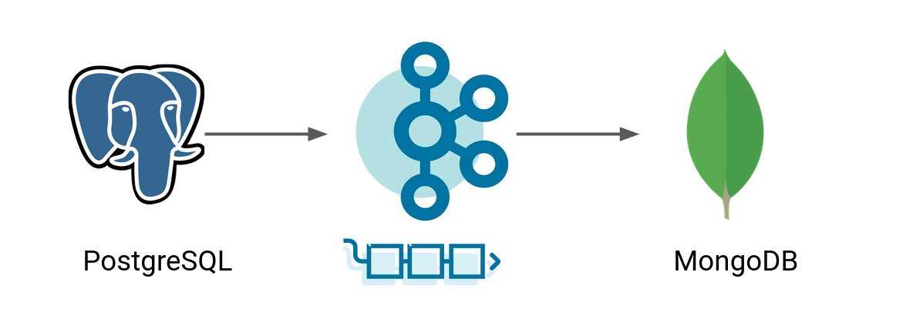

# Kafka Connect



We create a pipeline with a source (JDBC) and sink (MongoDB) Kafka connector.
To set up a PostgreSQL database, we use [dbeaver](https://dbeaver.io/) and for
MongoDB we use [MongoDB Compass](https://www.mongodb.com/products/compass).

All connectors can be downloaded on: [Confluent Hub](https://www.confluent.io/hub/).

## Run

Run setup:
```shell
docker-compose up -d
```
Start connectors:
```shell
curl -s -XGET http://localhost:8083/connector-plugins | jq '.[].class'
curl -X POST -H "Content-Type: application/json" --data @MongoDBConnector.json http://localhost:8083/connectors | jq
curl -X POST -H "Content-Type: application/json" --data @PostgreSqlConnector.json http://localhost:8083/connectors | jq
```


## Sources

* [MongoDB Connector](https://www.confluent.io/hub/mongodb/kafka-connect-mongodb)
* [MongoDB Connector Properties](https://docs.mongodb.com/kafka-connector/current/introduction/converters/#std-label-string-converter-sample-properties)
* [Set up MongoDB Connector with Kafka](https://www.confluent.io/de-de/blog/data-analytics-pipeline-with-kafka-and-rstudio/)
* [JDBC Connector](https://www.confluent.io/hub/confluentinc/kafka-connect-jdbc)
* [JDBC Connector Properties](https://docs.confluent.io/kafka-connect-jdbc/current/source-connector/source_config_options.html)
* [Deep dive JDBC Connector](https://www.confluent.io/blog/kafka-connect-deep-dive-jdbc-source-connector/#resetting)