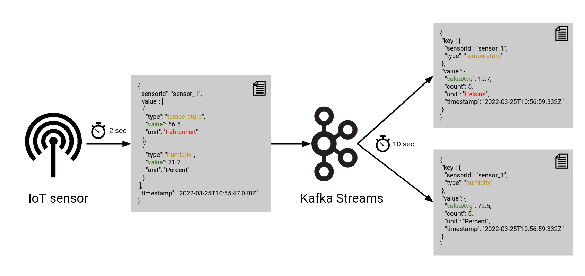

# Kafka Streams



We create a pipeline in which IoT data is processed with [Kafka Streams](https://kafka.apache.org/documentation/streams/).
Notify, that we use [Gradle](https://gradle.org/) to build and run the application.

You can generate the Java classes based on Avro schemas with:
```shell
 ./gradlew generateAvroJava
```

## Run

Run setup:
```shell
docker-compose up -d
```

Start Kafka Streams app:
```shell
./gradlew run
```

Data is then processed from one value per sensor every two seconds

```json
{
  "sensorId": "sensor_1",
  "value": [
    {
      "type": "temperature",
      "value": 66.5,
      "unit": "Fahrenheit"
    },
    {
      "type": "humidity",
      "value": 71.7,
      "unit": "Percent"
    }
  ],
  "timestamp": "2022-03-25T10:55:47.070Z"
}
```
to one aggregated value per sensor value type every 10 seconds.

```json
{
  "key": {
    "sensorId": "sensor_1",
    "type": "temperature"
  },
  "value": {
    "valueAvg": 19.7,
    "count": 5,
    "unit": "Celsius",
    "timestamp": "2022-03-25T10:56:59.332Z"
  }
}
```

## Sources

* [Java classes from Avro](https://github.com/davidmc24/gradle-avro-plugin)
* [Kafka Streams](https://kafka.apache.org/20/documentation/streams/developer-guide/dsl-api.html)
* [Kafka Avro Serde](https://docs.confluent.io/platform/current/streams/developer-guide/datatypes.html)