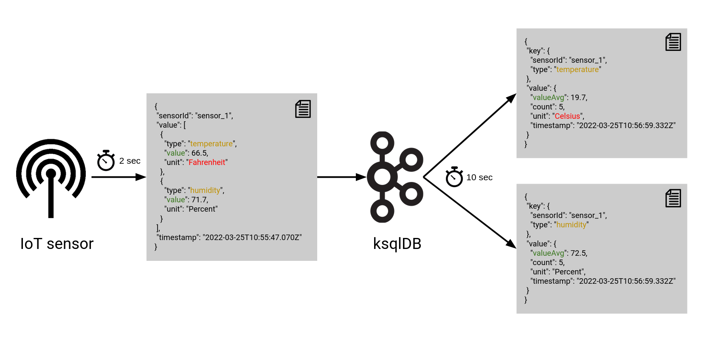

# ksqlDB



We create a pipeline in which IoT data is processed with [ksqlDB](https://ksqldb.io/).


## Run

Run setup:
```shell
docker-compose up -d
```

Start ksqlDB client:
```shell
docker exec -it ksqldb-cli ksql http://ksqldb-server:8088
```
and create all streams and tables.

Data is then processed from one value per sensor every two seconds

```json
{
  "sensorId": "sensor_1",
  "value": [
    {
      "type": "temperature",
      "value": 66.5,
      "unit": "Fahrenheit"
    },
    {
      "type": "humidity",
      "value": 71.7,
      "unit": "Percent"
    }
  ],
  "timestamp": "2022-03-25T10:55:47.070Z"
}
```
to one aggregated value per sensor value type every 10 seconds.

```json
{
  "key": {
    "sensorId": "sensor_1",
    "type": "temperature"
  },
  "value": {
    "valueAvg": 19.7,
    "count": 5,
    "unit": "Celsius",
    "timestamp": "2022-03-25T10:56:59.332Z"
  }
}
```

## Sources

* [ksqlDB Scalar Functions](https://docs.ksqldb.io/en/latest/developer-guide/ksqldb-reference/scalar-functions/#invocation-functions)
* [ksqlDB Aggregate Functions](https://docs.ksqldb.io/en/latest/developer-guide/ksqldb-reference/aggregate-functions/)
* [ksqlDB Avro](https://docs.ksqldb.io/en/latest/reference/serialization/#avro-records)